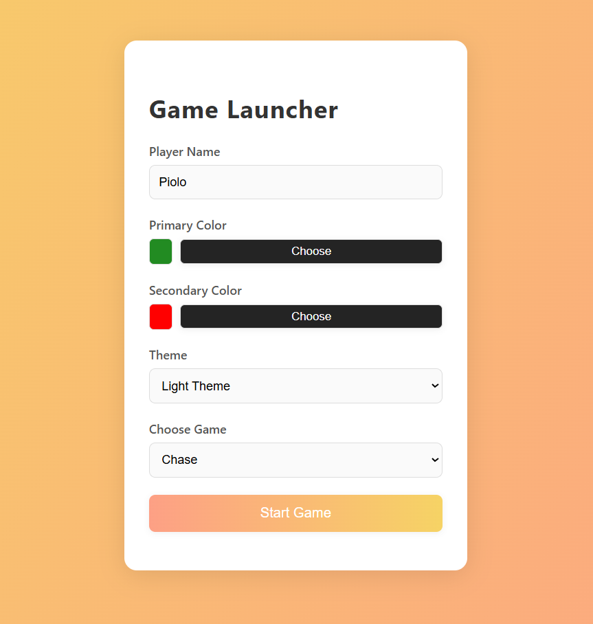
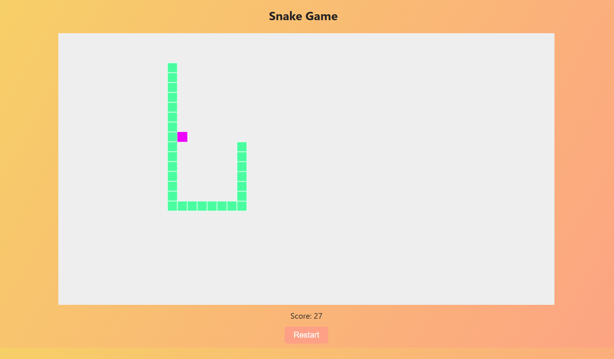
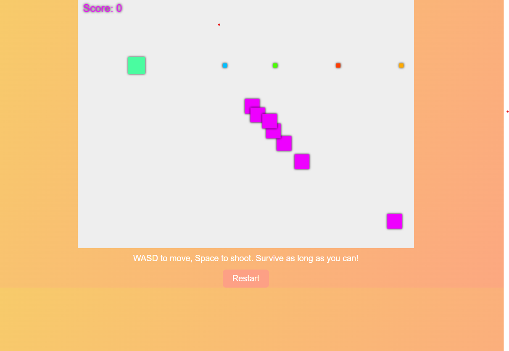

# 🎮 Html-Games

A collection of simple **HTML, CSS, and JavaScript-based games** playable directly in the browser.  
No frameworks, no installs — just open in your browser and play!

---

## 🚀 Features
- 🐍 **Snake Game** – Classic snake with border wrapping, custom colors, and scoring.  
- 🟩 **Chase Game** – Move, dodge, and shoot to survive against endless enemies.  
- 🎨 **Customization** – Choose player name, primary & secondary colors, and theme (light/dark).  
- 🌐 100% client-side – Works offline, no server required.  

---

## 📸 Screenshots

### Game Launcher


### Gameplay



---

## 🕹️ How to Play
1. Clone or download this repository.
   ```bash
   git clone https://github.com/your-username/html-games.git
